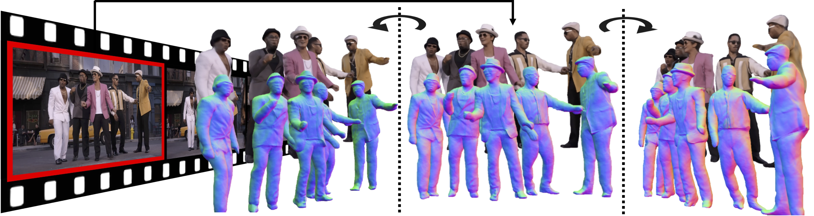
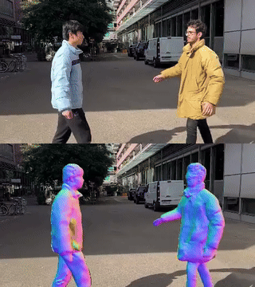

# MultiPly: Reconstruction of Multiple People from Monocular Video in the Wild
## [Paper]() | [Video Youtube](https://youtu.be/cmKLbKXVMek) | [Project Page](https://jzr99.github.io/MultiPly/) | [MMM Data (Coming Soon)]()


Official Repository for CVPR 2024 paper [*MultiPly: Reconstruction of Multiple People from Monocular Video in the Wild*](). 
<p align="center">
 
</p>

## Getting Started
* Clone this repo: `git clone https://github.com/jzr99/MultiPly`
* Create a python virtual environment and activate. `conda create -n multiply python=3.7` and `conda activate multiply`
* Install dependenices. `cd MultiPly`, `pip install -r requirement.txt` and `cd code; python setup.py develop`
* Install [PyTorch3D](https://github.com/facebookresearch/pytorch3d/blob/main/INSTALL.md)
* Install [Kaolin](https://kaolin.readthedocs.io/en/v0.10.0/notes/installation.html). We use version 0.13.0.
* Download [SMPL model](https://smpl.is.tue.mpg.de/download.php) (version 1.1.0 for Python 2.7 (female/male/neutral)) and move them to the corresponding places:
```
mkdir code/lib/smpl/smpl_model/
mv /path_to_smpl_models/basicmodel_f_lbs_10_207_0_v1.1.0.pkl code/lib/smpl/smpl_model/SMPL_FEMALE.pkl
mv /path_to_smpl_models/basicmodel_m_lbs_10_207_0_v1.1.0.pkl code/lib/smpl/smpl_model/SMPL_MALE.pkl
mv /path_to_smpl_models/basicmodel_neutral_lbs_10_207_0_v1.1.0.pkl code/lib/smpl/smpl_model/SMPL_NEUTRAL.pkl
```
* Download SAM model (if you have limited GPU Memory, try to download a smaller one vit_b. Remember to change the base model in `./code/lib/model/sam_model.py`)
```
wget -P ./code/outputs/ https://dl.fbaipublicfiles.com/segment_anything/sam_vit_h_4b8939.pth

wget -P ./code/outputs/ https://dl.fbaipublicfiles.com/segment_anything/sam_vit_b_01ec64.pth
```
* Download the pretrained SDF human model
```
gdown 1-HvSz0enbBQIyJLnM0GJVrixj-1ycAJK -O ./code/outputs/
```

## Download preprocessed demo data
You can quickly start trying out MultiPly with a preprocessed demo sequence from Internet. This can be downloaded from [Google drive](https://drive.google.com/drive/folders/1dAZIb-CyEpqvu4LNA35w_YEhLRNqNegP?usp=sharing). Put this preprocessed demo data under the folder `data/`.

## Training
Before training, make sure that the `metaninfo` in the data config file `/code/confs/dataset/*.yaml` does match the expected training video. You can also continue the training by changing the flag `is_continue` in the model config file `code/confs/model/*_model.yaml`. And then run:
```
cd code
python train.py
```
The training usually takes 24 * number_of_people hours. The validation results can be found at `outputs/`.
## Test
Run the following command to obtain the final outputs. By default, this loads the latest checkpoint.
```
cd code
python test.py
```
## 3D Visualization
We use [AITViewer](https://github.com/eth-ait/aitviewer) to visualize the human models in 3D. First install AITViewer: `pip install aitviewer imgui==1.4.1`, and then run the following command to visualize the deformed mesh sequence and reproject it onto the corresponding frames:
```
cd ait_viewer_vis
python vis_mesh_image.py --input_root {input data folder} --output_root {Multiply output folder}
```
<p align="center">
   
</p>

## Play on custom video 
* It's better to install those package into separate environments, then specify the environment name in `run_preprocessing_multiply.sh`.
* Install [TRACE](https://github.com/Arthur151/ROMP/blob/master/simple_romp/trace2/README.md) for initial pose estimation and tracking. 
* Install [Vitpose](https://github.com/ViTAE-Transformer/ViTPose?tab=readme-ov-file#usage) for 2D keypoint detection. Download the pre-trained model from [here](https://1drv.ms/u/s!AimBgYV7JjTlgS5rLeRAJiWobCdh?e=41GsDd), and save it as `preprocessing/vitpose/checkpoints/vitpose-h-multi-coco.pth`
* (Optional) Install [OpenPose](https://github.com/CMU-Perceptual-Computing-Lab/openpose/blob/master/doc/installation/0_index.md) as well as the python bindings for better feet keypoints estimation.
* Install [FFMPEG](https://ffmpeg.org/download.html) for video processing.
* Modify the preprocessing script `preprocessing/run_preprocessing_multiply.sh` accordingly: the data source, data path, sequence name, environment name. The data source is by default "custom" which will estimate camera intrinsics. If the camera intrinsics are known, it's better if the true camera parameters can be given.
* Run preprocessing: `cd preprocessing` and `bash run_preprocessing_multiply.sh`. The processed data will be stored in `data/`. The intermediate outputs of the preprocessing can be found at `preprocessing/raw_data/{SEQUENCE_NAME}/`
* Launch training and test in the same way as above. The `metainfo` in the data config file `/code/confs/dataset/*.yaml` should be changed according to the custom video.

<p align="center">
     
</p>

## Acknowledgement
We have used codes from other great research work, including [VolSDF](https://github.com/lioryariv/volsdf), [NeRF++](https://github.com/Kai-46/nerfplusplus), [SMPL-X](https://github.com/vchoutas/smplx), [Anim-NeRF](https://github.com/JanaldoChen/Anim-NeRF), [Vid2Avatar](https://github.com/MoyGcc/vid2avatar/), [I M Avatar](https://github.com/zhengyuf/IMavatar) and [SNARF](https://github.com/xuchen-ethz/snarf).  We sincerely thank the authors for their awesome work! We also thank the authors of [ECON](https://github.com/YuliangXiu/ECON) for discussing the experiment.

## Related Works 
Here are more recent related human body reconstruction projects from our team:
* [Vid2Avatar: 3D Avatar Reconstruction from Videos in the Wild via Self-supervised Scene Decomposition](https://github.com/MoyGcc/vid2avatar/)
* [InstantAvatar: Learning Avatars from Monocular Video in 60 Seconds](https://github.com/tijiang13/InstantAvatar)
* [X-Avatar: Expressive Human Avatars](https://skype-line.github.io/projects/X-Avatar/)
* [Hi4D: 4D Instance Segmentation of Close Human Interaction](https://yifeiyin04.github.io/Hi4D/)

```
@inproceedings{jiang2024multiply,
      title={MultiPly: Reconstruction of Multiple People from Monocular Video in the Wild},
      author={Jiang, Zeren and Guo, Chen and Kaufmann, Manuel and Jiang, Tianjian and Valentin, Julien and Hilliges, Otmar and Song, Jie},    
      booktitle = {Proceedings of the IEEE/CVF Conference on Computer Vision and Pattern Recognition (CVPR)},
      month     = {June},
      year      = {2024},
    }
```
